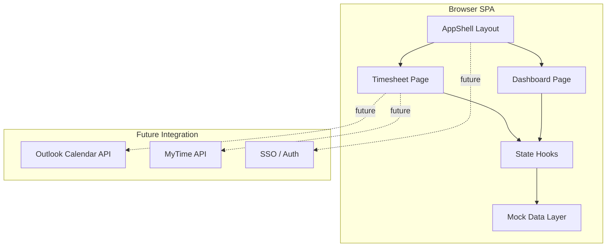
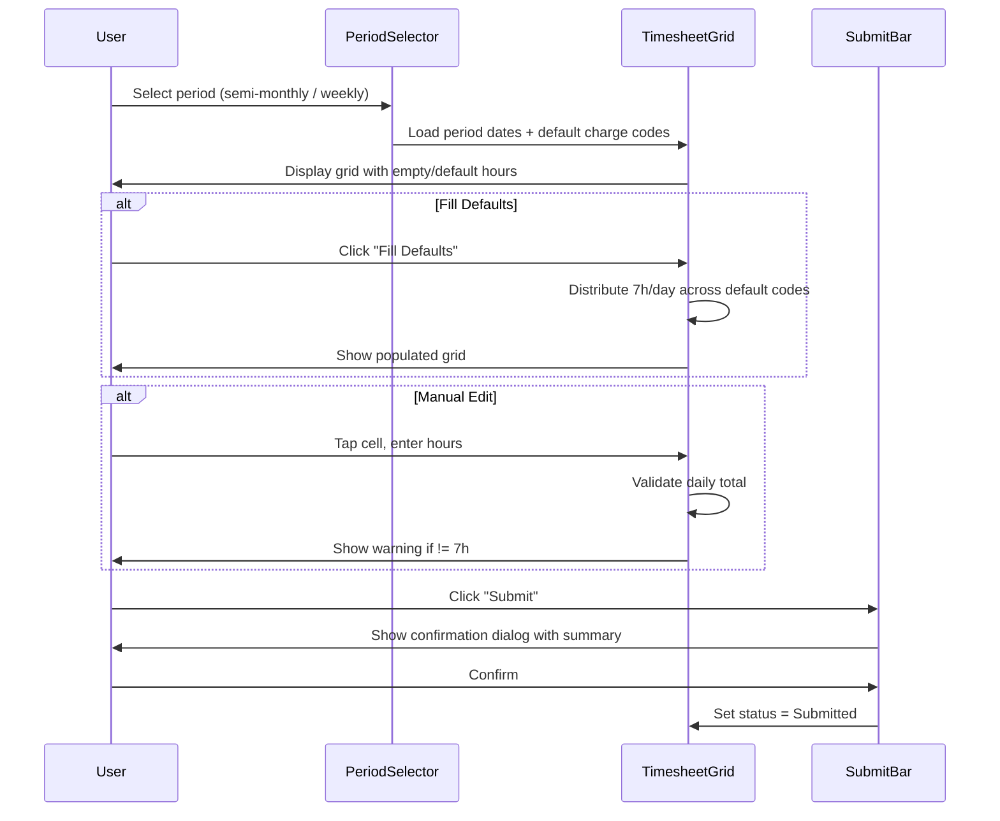
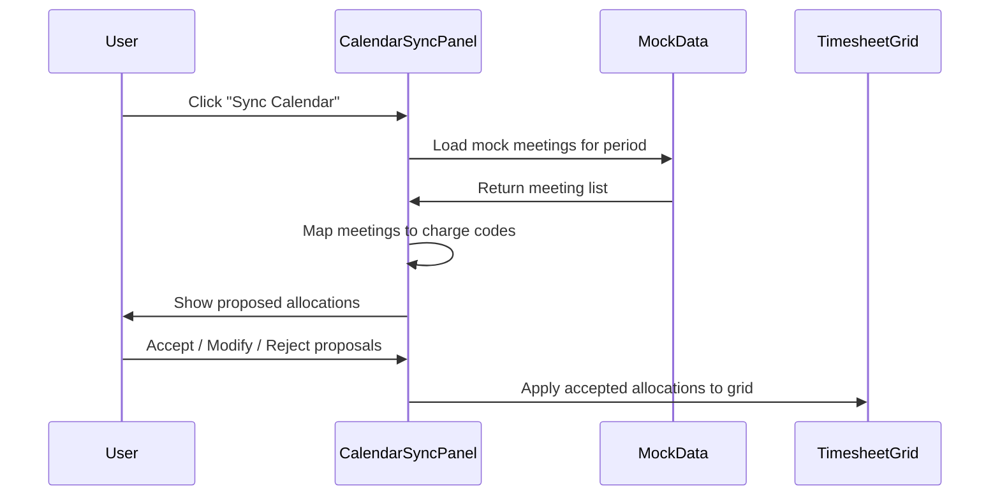
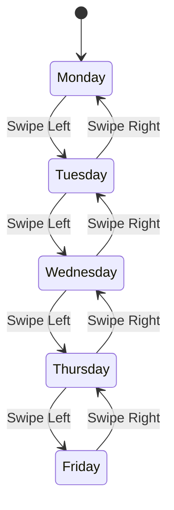
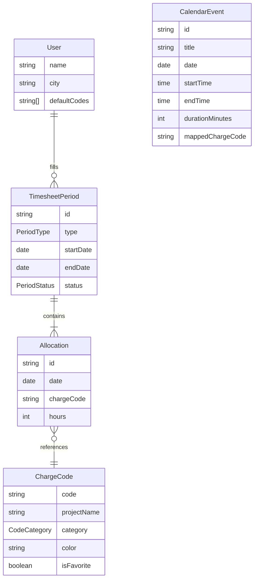

# Design Document — Timesheet Redesign POC

---
**Purpose**: Provide sufficient detail to build the timesheet redesign POC on v0.app with consistent implementation across screens.

**Approach**: Frontend-only SPA with mock data. Focus on UX fidelity for leadership demo, not backend integration.
---

## Overview

**Purpose**: This POC delivers a modern, mobile-responsive timesheet entry experience to leadership stakeholders, demonstrating how the current MyTime (Infor Extensity) system could be reimagined.

**Users**: McKinsey consultants and engineers filling semi-monthly/weekly timesheets. Secondary audience is leadership evaluating the POC for firm-wide adoption.

**Impact**: Replaces the current 15-step, 10-minute manual entry process with a 3-step, sub-2-minute experience through smart defaults, visual feedback, and mobile support.

### Goals
- Demonstrate a 5x reduction in time-to-submit (10 min to 2 min)
- Provide a polished, mobile-first UI suitable for a leadership presentation
- Show the concept of calendar-driven hour allocation (mocked)
- Give users visibility into their hour distribution via a dashboard

### Non-Goals
- Real authentication or SSO integration
- Live Outlook calendar API calls
- Actual MyTime upload or submission to Infor Extensity
- Multi-user support or role-based access
- Backend persistence (database, API server)
- Approval workflow processing

## Boundary Commitments

### This Spec Owns
- All frontend UI components (grid, dashboard, navigation, modals)
- Client-side state management for timesheet data
- Mock data layer (charge codes, sample allocations, fake calendar events)
- Responsive layout breakpoints and mobile card view
- Visual design system (colors, typography, spacing)

### Out of Boundary
- Backend API development
- Real calendar integration (deferred to future phase)
- MyTime file generation (handled by existing `smart_timesheet_assistant`)
- Authentication and user management
- Deployment infrastructure beyond Vercel free tier

### Allowed Dependencies
- shadcn/ui component library (via v0)
- Recharts for dashboard visualizations
- date-fns for date calculations
- Vercel for hosting

### Revalidation Triggers
- If a backend API is added, data layer must switch from mock imports to fetch calls
- If real calendar integration is added, the mock sync flow must be replaced with OAuth + Graph API
- If the firm's design system changes, color tokens and typography must be updated

## Architecture

### Architecture Pattern & Boundary Map



**Architecture Integration**:
- Selected pattern: **Client-side SPA** — no server, all logic in React components and hooks
- Domain boundaries: Timesheet entry (grid + calendar sync) and Analytics (dashboard) are separate route-level features sharing state via hooks
- Existing patterns preserved: None (greenfield POC)
- New components rationale: Each component maps to a distinct UX responsibility
- Steering compliance: Follows tech.md (Next.js + shadcn/ui + Tailwind) and structure.md (feature-first organization)

### Technology Stack

| Layer | Choice / Version | Role in Feature | Notes |
|-------|-----------------|-----------------|-------|
| Frontend | Next.js 15 + React 19 | App framework, routing, rendering | App Router with client components |
| UI Components | shadcn/ui + Radix | Buttons, cards, dialogs, inputs, tabs | Copy-paste ownership model |
| Styling | Tailwind CSS v4 | Responsive layout, design tokens | Mobile-first breakpoints |
| Charts | Recharts 2.x | Dashboard donut/bar/trend charts | Lightweight, React-native API |
| Dates | date-fns 3.x | Period calculation, weekday detection | Tree-shakeable |
| Icons | lucide-react | UI iconography | Consistent with shadcn |
| Animation | framer-motion 11.x | Page transitions, mobile swipe | Optional enhancement |
| Hosting | Vercel | CDN, HTTPS, preview URLs | Free tier, one-click from v0 |

## File Structure Plan

### Directory Structure
```
app/
├── layout.tsx              # Root layout with AppShell
├── page.tsx                # Redirect to /timesheet
├── timesheet/
│   └── page.tsx            # Timesheet grid page
├── dashboard/
│   └── page.tsx            # Dashboard page
└── globals.css             # Tailwind base + design tokens

components/
├── layout/
│   ├── AppShell.tsx         # Header + main + bottom nav wrapper
│   ├── TopNav.tsx           # Desktop top navigation bar
│   └── BottomNav.tsx        # Mobile bottom tab bar
├── timesheet/
│   ├── TimesheetGrid.tsx    # Desktop grid (rows=codes, cols=days)
│   ├── TimesheetRow.tsx     # Single charge code row with hour cells
│   ├── HourCell.tsx         # Editable hour input cell
│   ├── DayCard.tsx          # Mobile card for a single day
│   ├── MobileDayView.tsx    # Mobile swipeable day cards
│   ├── PeriodSelector.tsx   # Period type toggle + date nav
│   ├── ChargeCodePicker.tsx # Searchable grouped code selector
│   ├── CalendarSyncPanel.tsx # Mock calendar sync UI
│   └── SubmitBar.tsx        # Submit/Recall action bar with status
├── dashboard/
│   ├── StatusCard.tsx       # Period status badge (Draft/Submitted/Approved)
│   ├── HoursDonutChart.tsx  # Hours by charge code donut
│   ├── TrendChart.tsx       # Multi-period trend line/bar chart
│   └── QuickActions.tsx     # Fill Defaults, Copy Last Period buttons
└── ui/                      # shadcn/ui primitives (auto-generated)

hooks/
├── useTimesheet.ts          # Core state: allocations, CRUD, totals
├── useChargeCodes.ts        # Charge code list, search, favorites
├── usePeriod.ts             # Period selection, navigation, date math
└── useCalendarSync.ts       # Mock calendar sync state machine

data/
├── charge-codes.json        # Mock charge code catalog
├── mock-allocations.ts      # Sample pre-filled timesheet data
├── mock-calendar.ts         # Fake Outlook meetings for sync demo
└── mock-history.ts          # Past period data for dashboard trends

types/
├── timesheet.ts             # TimesheetPeriod, Allocation, PeriodStatus
├── charge-code.ts           # ChargeCode, CodeCategory
└── calendar.ts              # CalendarEvent, SyncProposal

lib/
├── date-utils.ts            # Period generation, weekday checks
├── hour-validator.ts        # Daily total validation, warnings
└── constants.ts             # Colors, default hours, breakpoints
```

### Modified Files
- None (greenfield project)

## System Flows

### Timesheet Entry Flow (Primary)



### Calendar Sync Flow (Mock)



### Mobile Day Navigation



## Requirements Traceability

| Requirement | Summary | Components | Interfaces | Flows |
|-------------|---------|------------|------------|-------|
| 1 | Fast Grid Entry | TimesheetGrid, TimesheetRow, HourCell | useTimesheet | Entry Flow |
| 2 | Period Selection | PeriodSelector | usePeriod | Entry Flow |
| 3 | Charge Code Mgmt | ChargeCodePicker | useChargeCodes | Entry Flow |
| 4 | Calendar Sync | CalendarSyncPanel | useCalendarSync | Sync Flow |
| 5 | Dashboard | StatusCard, HoursDonutChart, TrendChart, QuickActions | useTimesheet | — |
| 6 | Mobile Responsive | MobileDayView, DayCard, BottomNav | — | Day Nav |
| 7 | Visual Feedback | HourCell (warnings), SubmitBar | hour-validator | Entry Flow |
| 8 | Recall | SubmitBar | useTimesheet | Entry Flow |
| 9 | Modern Design | All components (design tokens) | constants.ts | — |
| 10 | Quick Actions | QuickActions, TimesheetGrid | useTimesheet | Entry Flow |

## Components and Interfaces

| Component | Domain/Layer | Intent | Req Coverage | Key Dependencies | Contracts |
|-----------|-------------|--------|--------------|------------------|-----------|
| AppShell | Layout | Responsive app wrapper with nav | 6, 9 | TopNav, BottomNav | — |
| TimesheetGrid | Timesheet | Desktop editable hour grid | 1, 7 | useTimesheet, TimesheetRow | State |
| MobileDayView | Timesheet | Mobile card-based day navigation | 6 | DayCard, usePeriod | State |
| PeriodSelector | Timesheet | Period type and date navigation | 2 | usePeriod | State |
| ChargeCodePicker | Timesheet | Searchable grouped code selector | 3 | useChargeCodes | State |
| CalendarSyncPanel | Timesheet | Mock calendar sync proposals | 4 | useCalendarSync | State |
| SubmitBar | Timesheet | Submit/Recall with status display | 7, 8 | useTimesheet | State |
| StatusCard | Dashboard | Period status badge | 5 | useTimesheet | — |
| HoursDonutChart | Dashboard | Hours by code visualization | 5 | useTimesheet, Recharts | — |
| TrendChart | Dashboard | Multi-period trend chart | 5 | mock-history, Recharts | — |
| QuickActions | Dashboard | Fill Defaults, Copy Last Period | 10 | useTimesheet | State |

### Timesheet Domain

#### TimesheetGrid

| Field | Detail |
|-------|--------|
| Intent | Render an editable grid of charge code rows x day columns with real-time totals |
| Requirements | 1, 7 |

**Responsibilities & Constraints**
- Renders one `TimesheetRow` per active charge code
- Computes and displays column totals (daily) and row totals (per code)
- Delegates cell editing to `HourCell`
- Desktop only — replaced by `MobileDayView` below 768px

**Dependencies**
- Inbound: `PeriodSelector` provides the date range
- Outbound: `useTimesheet` hook for allocation state CRUD

##### State Management
- State model: `Record<string, Record<string, number>>` (date → code → hours)
- Persistence: React state (lost on refresh for POC; localStorage stretch goal)
- Concurrency: Single user, no conflicts

#### CalendarSyncPanel

| Field | Detail |
|-------|--------|
| Intent | Simulate Outlook calendar sync by loading mock meetings and proposing charge code mappings |
| Requirements | 4 |

**Responsibilities & Constraints**
- Loads mock meeting data from `data/mock-calendar.ts`
- Maps meeting titles to charge codes using simple substring matching
- Displays proposals in a reviewable list (accept/reject per meeting)
- On accept, writes proposed hours into `useTimesheet` state

**Dependencies**
- Outbound: `useTimesheet` to write accepted allocations
- External: None (mock data only; future: Microsoft Graph API)

##### State Management
- State model: `SyncProposal[]` with status (pending/accepted/rejected)
- Three-step flow: idle → loading (fake 1.5s delay) → review proposals

### Dashboard Domain

#### HoursDonutChart

| Field | Detail |
|-------|--------|
| Intent | Visualize current period's hour distribution by charge code |
| Requirements | 5 |

**Responsibilities & Constraints**
- Renders a Recharts `PieChart` with one slice per charge code
- Colors match the charge code category colors from design tokens
- Shows total hours in the center label
- Responsive: full width on mobile, 50% on desktop alongside TrendChart

#### TrendChart

| Field | Detail |
|-------|--------|
| Intent | Show hour distribution across the last 4 periods as a stacked bar chart |
| Requirements | 5 |

**Responsibilities & Constraints**
- Renders a Recharts `BarChart` with stacked bars per charge code
- X-axis: period labels (e.g., "May 1–15", "May 16–31")
- Data source: `data/mock-history.ts` (static past periods)

## Data Models

### Domain Model



### Logical Data Model

**Types** (defined in `types/`):

```typescript
type PeriodType = 'weekly' | 'semi-monthly'
type PeriodStatus = 'draft' | 'submitted' | 'approved'
type CodeCategory = 'grow' | 'run' | 'non-billable'

interface ChargeCode {
  code: string
  projectName: string
  category: CodeCategory
  color: string
  isFavorite: boolean
}

interface TimesheetPeriod {
  id: string
  type: PeriodType
  startDate: string   // ISO date
  endDate: string     // ISO date
  status: PeriodStatus
  statusHistory: StatusChange[]
}

interface StatusChange {
  from: PeriodStatus
  to: PeriodStatus
  timestamp: string
}

interface Allocation {
  date: string         // ISO date
  chargeCode: string
  hours: number        // integer, 0-24
}

interface CalendarEvent {
  id: string
  title: string
  date: string
  startTime: string
  endTime: string
  durationMinutes: number
}

interface SyncProposal {
  event: CalendarEvent
  suggestedCode: string
  suggestedHours: number
  status: 'pending' | 'accepted' | 'rejected'
}
```

### Physical Data Model
Not applicable — no database in POC. All data is in-memory React state initialized from JSON imports.

## Error Handling

### Error Strategy
Client-side validation only. No server errors possible in the POC.

### Error Categories and Responses

**User Errors**:
- Daily hours != 7 → amber/red cell border + tooltip "Expected 7 hours, got X"
- Hours out of range (negative or >24) → input rejected, value clamped
- Weekend hour entry → cells disabled, non-editable
- Empty timesheet submission → submit button disabled until at least one day has hours

**Business Logic Errors**:
- Duplicate charge code added → picker shows "Already added" badge, prevents duplicate
- Recall on draft timesheet → recall button hidden when status is draft

### Monitoring
Not applicable for POC. Future: error tracking via Vercel Analytics or Sentry.

## Testing Strategy

Not required for POC phase. Documented for future reference:

- **Unit Tests**: `hour-validator.ts` (daily total checks), `date-utils.ts` (period generation, weekday detection), `useTimesheet` hook (add/edit/delete allocations)
- **E2E Tests**: Complete fill → submit flow, Calendar sync → accept → verify grid, Mobile day swipe navigation
- **Visual Regression**: Screenshot comparison of grid and dashboard across breakpoints

## Design Tokens

### Colors

| Token | Value | Usage |
|-------|-------|-------|
| `--primary` | `#003A6B` | McKinsey navy, headers, primary buttons |
| `--primary-light` | `#0066B3` | Hover states, active tabs |
| `--grow` | `#2563EB` | Grow charge code category |
| `--run` | `#16A34A` | Run charge code category |
| `--non-billable` | `#6B7280` | Non-billable category |
| `--warning` | `#F59E0B` | Under 7h daily total |
| `--error` | `#EF4444` | Over 7h daily total |
| `--success` | `#22C55E` | Exactly 7h, ready to submit |
| `--surface` | `#FFFFFF` | Card backgrounds (light mode) |
| `--surface-dark` | `#1E293B` | Card backgrounds (dark mode) |

### Typography
- **Headings**: Inter, 600 weight
- **Body**: Inter, 400 weight
- **Data/numbers**: JetBrains Mono or tabular-nums for aligned hour values

### Breakpoints
- **Mobile**: < 768px (card-based day view, bottom nav)
- **Tablet**: 768px–1024px (condensed grid, side nav)
- **Desktop**: > 1024px (full grid, top nav)

## Deployment

- **Live URL**: https://v0-mytime-redefined.vercel.app/
- **v0 Chat**: https://v0.app/chat/hSUGgViFK8S
- **Platform**: Vercel (auto-deploys on v0 changes)
- **Sensitive Data**: None — all charge codes, user names, and project names are generic/fictional

---
_Design document for leadership-demo POC. Backend integration, real auth, and calendar API are deferred to future phases._
